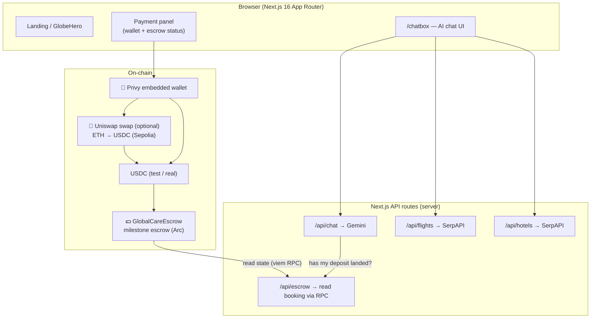

# GlobalCare.ai — Technical Blueprint

Build spec for the payment layer. Pairs with [ROADMAP.md](./ROADMAP.md) (order) and [prizes.md](./prizes.md) (bounties). **Scope: Privy + Uniswap (optional) + Arc escrow only.** No ENS, no The Graph, no other sponsors.

---

## 1. System architecture



**One-line flow:** AI intake → hospital/country + flights + hotels + total → Privy wallet → (optional Uniswap swap to USDC) → USDC into Arc escrow → milestones release to hospital → AI reads escrow state directly via RPC.

---

## 2. Privy wallet layer (build first)

- Add `@privy-io/react-auth` (+ `@privy-io/wagmi`, `wagmi`, `viem`). Wrap the app in `<PrivyProvider>` in `app/layout.tsx` (client boundary).
- **Login upfront** on "Start your journey" — email / Google / wallet. Config: `embeddedWallets: { createOnLogin: 'users-without-wallets' }` → wallet ready by the time the patient reaches payment, **no seed phrase**.
- Use the Privy wallet as the signer for `approve(USDC)` + `deposit(id)`.
- **Privy bounty:** the USDC payment is the "one functional financial flow" — that's what qualifies.

---

## 3. Uniswap swap (optional — only if non-USDC funding)

- If the patient holds ETH (or another token) instead of USDC, swap to USDC **before** escrow using the Uniswap API / v4 on a supported testnet (Sepolia).
- Keep it a single, clear swap step in the payment panel; skip entirely if we assume patients already hold USDC.
- **Uniswap bounty (if entered):** public repo + `FEEDBACK.md` + feedback form; README must point to the swap integration. A v4 hook scores higher but is a stretch.
- Confidence is 4–5/10 — treat as a bonus, not a dependency.

---

## 4. The escrow contract (Arc — built last)

`GlobalCareEscrow.sol` — one escrow per patient booking, milestone-based release. Built on **Arc Testnet**, then deployed / deploy-ready on **Arc Mainnet** for the bounty (deadline Sep 30). Arc has native USDC, so no bridging.

### State machine
```
CREATED ──deposit()──▶ FUNDED ──releaseMilestone()──▶ PARTIALLY_RELEASED ──▶ COMPLETED
   │                     │
   │                     └──refund() (dispute / no-show)──▶ REFUNDED
   └── expire (no deposit)
```

### Milestones (default 3, configurable)
1. **Consultation confirmed** — small % (e.g. 10%)
2. **Treatment done** — main tranche (e.g. 70%)
3. **Aftercare / patient sign-off** — remainder (e.g. 20%)

### Interface (sketch)
```solidity
struct Booking {
    address patient;
    address hospital;
    uint256 total;         // USDC (6 decimals)
    uint256 released;
    uint8   milestonesDone;
    Status  status;
}

function createBooking(bytes32 id, address hospital, uint256 total) external;
function deposit(bytes32 id) external;                          // patient (approve USDC first)
function releaseMilestone(bytes32 id, uint256 amount) external; // onlyTrustee
function refund(bytes32 id) external;                           // onlyTrustee, on dispute
function getBooking(bytes32 id) external view returns (Booking memory);

event BookingCreated(bytes32 indexed id, address patient, address hospital, uint256 total);
event Deposited(bytes32 indexed id, uint256 amount, uint256 at);
event MilestoneReleased(bytes32 indexed id, uint8 milestone, uint256 amount, uint256 at);
event Refunded(bytes32 indexed id, uint256 amount, uint256 at);
```

> Trustee = GlobalCare (or a small multisig). `onlyTrustee` is enough for the demo. Tooling: Foundry or Hardhat in `contracts/`, verify on HashScan/explorer.

---

## 5. Reading escrow state (no The Graph)

The AI answers "has my deposit landed?" by reading the contract **directly via RPC** — no indexer needed at this scale.

- `/api/escrow` uses `viem`'s `readContract` → `getBooking(id)` → returns status, deposited amount, milestones done.
- `/api/chat` detects the "payment status" intent → calls `/api/escrow` → AI answers in natural language: *"Yes — your $3,000 deposit was received; the consultation milestone (10%) is next."*
- For deposit events, use `getLogs` / `watchEvent` on the escrow address if you want a live confirmation toast.

---

## 6. Additions to the current file structure

```
globalcare-ai/
├── contracts/                     # NEW — Foundry/Hardhat (built last, Arc)
│   ├── GlobalCareEscrow.sol
│   └── test/ …
├── app/
│   ├── api/
│   │   ├── chat/route.ts          # extend: detect "payment status" intent → /api/escrow
│   │   ├── flights/route.ts       # (existing)
│   │   ├── hotels/route.ts        # (existing)
│   │   └── escrow/route.ts        # NEW — read booking via viem RPC
│   ├── chatbox/page.tsx           # add payment panel (+ optional voice controls)
│   └── layout.tsx                 # wrap in PrivyProvider
├── lib/
│   ├── systemPrompt.ts            # add payment + status instructions
│   ├── escrow.ts                  # NEW — ABI + viem client, read/build tx
│   ├── swap.ts                    # NEW (optional) — Uniswap swap helper
│   └── ics.ts                     # NEW (optional) — itinerary → .ics
└── .env.local                     # add keys below (NEXT_PUBLIC_MAPBOX_TOKEN is unused — can delete)
```

### Env vars to add
```
NEXT_PUBLIC_PRIVY_APP_ID=
PRIVY_APP_SECRET=
NEXT_PUBLIC_ESCROW_ADDRESS_ARC_TESTNET=
NEXT_PUBLIC_ESCROW_ADDRESS_ARC_MAINNET=
NEXT_PUBLIC_USDC_ADDRESS_ARC_TESTNET=
NEXT_PUBLIC_USDC_ADDRESS_ARC_MAINNET=
ARC_TESTNET_RPC_URL=
ARC_MAINNET_RPC_URL=
SEPOLIA_RPC_URL=        # only if doing the Uniswap swap
```

---

## 7. Optional polish (last, must not block core)

- **🗣️ Multilingual voice chat** — input via browser `SpeechRecognition` → `/api/chat`; output via `SpeechSynthesis`. Gemini already handles Hindi / Telugu / English + destination languages; pass the locale in the system prompt. No new service.
- **📅 One-tap `.ics` itinerary** — build an `.ics` string (consultation, treatment, hotel, flights, recovery), one download button. No new service.

---

## 8. Demo script (2–4 min)

1. Patient chats → hair-transplant recommendation (Turkey) + flights + hotel + total. *(existing, polished)*
2. "Start your journey" → Privy login → embedded wallet appears — **no seed phrase**.
3. *(optional)* Patient's ETH → USDC via Uniswap in the payment panel.
4. Patient deposits **USDC** into the Arc escrow — one click.
5. Patient asks the AI *"Has my deposit gone through?"* → AI answers from live on-chain state (RPC). ✨
6. Trustee releases milestone 1 → AI reflects the new status.
7. Show the **same escrow deployed / deploy-ready on Arc Mainnet**.
8. *(if built)* speak the query in Hindi; tap "Add journey to calendar."

---

## 9. Guardrails

- Testnet proves functionality; **Arc Mainnet deployment satisfies the bounty** — don't bridge test tokens between networks.
- Every submission: public repo + demo video. Arc needs an architecture diagram; deploy/deploy-ready by **Sep 30**.
- Scope guard: Privy → (Uniswap) → Arc. No ENS, Graph, World, Chainlink, Hedera, Bazantic, 1inch.
